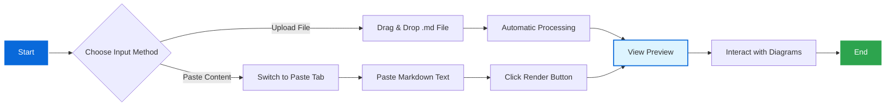
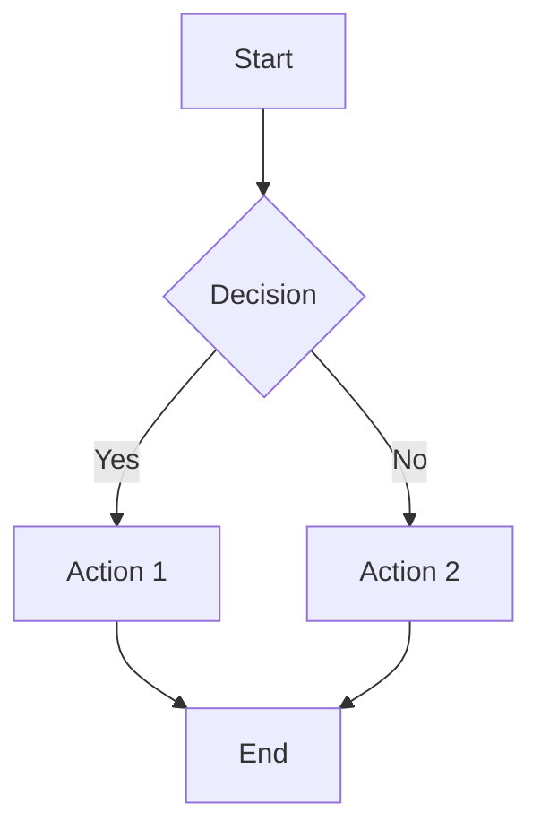
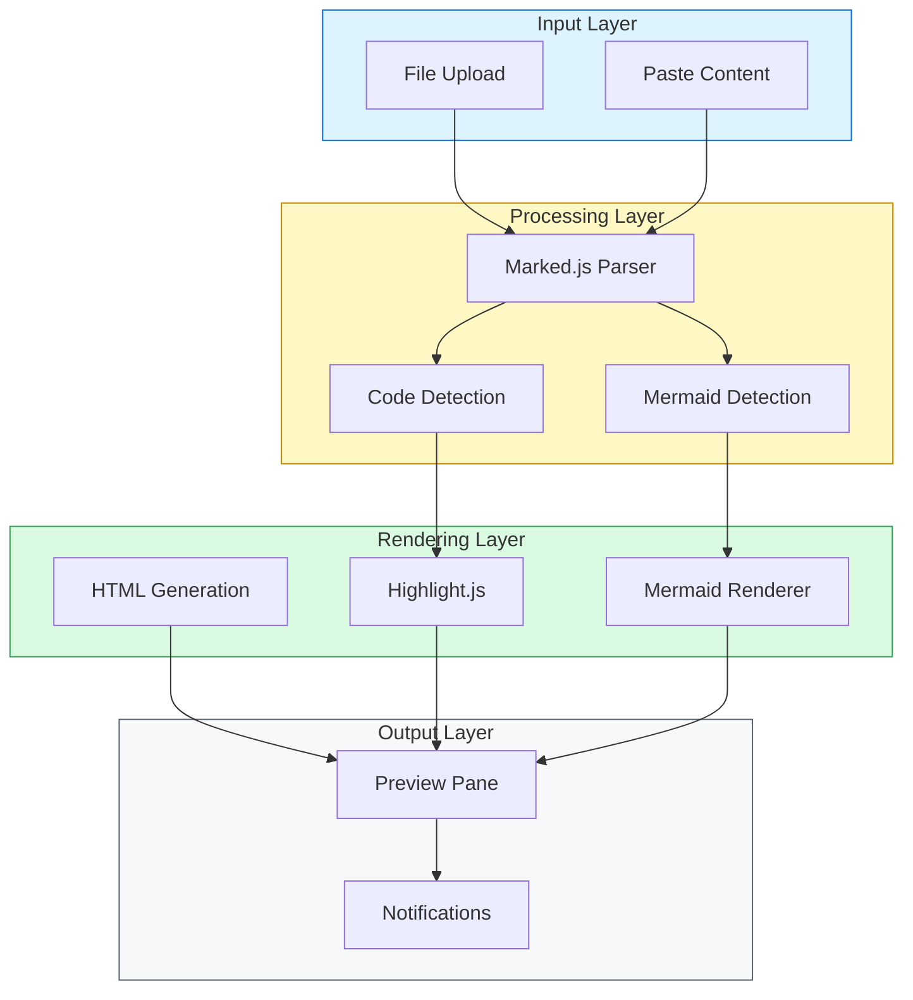

# xsukax Markdown Viewer

A modern, lightweight, and secure client-side markdown viewer with GitHub-inspired design and advanced diagram rendering capabilities.

[](https://xsukax.github.io/xsukax-Markdown-Viewer)
[](LICENSE)
[](https://developer.mozilla.org/en-US/docs/Web/HTML)
[](https://developer.mozilla.org/en-US/docs/Web/JavaScript)

## 📋 Project Overview

xsukax Markdown Viewer is a standalone, browser-based markdown rendering application that provides real-time visualization of markdown content with integrated Mermaid diagram support. Built as a single HTML file with no backend dependencies, it offers a seamless experience for viewing and previewing markdown documents directly in your browser.

The application features a clean, GitHub-inspired interface that supports both file uploads and direct content pasting, making it versatile for various workflows. With syntax highlighting powered by highlight.js and diagram rendering via Mermaid, it delivers a comprehensive markdown viewing experience suitable for developers, technical writers, and documentation enthusiasts.

**Live Demo:** [https://xsukax.github.io/xsukax-Markdown-Viewer](https://xsukax.github.io/xsukax-Markdown-Viewer)

## 🔒 Security and Privacy Benefits

xsukax Markdown Viewer prioritizes user security and privacy through its architecture and design principles:

### Client-Side Processing
- **Zero Server Communication**: All markdown parsing and rendering occurs entirely within your browser. No data is transmitted to external servers, ensuring complete privacy of your content.
- **No Data Collection**: The application does not collect, store, or transmit any user data, analytics, or telemetry information.
- **Offline Capability**: Once loaded, the application functions without internet connectivity, allowing secure document viewing in air-gapped environments.

### Secure Content Handling
- **No External Data Storage**: Uploaded files and pasted content remain in browser memory only and are never persisted to disk or cloud storage without explicit user action.
- **XSS Protection**: Mermaid diagrams are rendered with appropriate security configurations to prevent cross-site scripting vulnerabilities.
- **Sandboxed Execution**: All code execution happens within the browser's security sandbox, isolating the application from system-level access.

### Dependency Security
- **Minimal Attack Surface**: Uses only well-established, widely-audited libraries (marked.js, highlight.js, Mermaid) loaded from trusted CDNs with integrity verification.
- **No Third-Party Tracking**: No integration with analytics services, social media widgets, or advertising networks.

### Data Control
- **User Data Sovereignty**: Users maintain complete control over their markdown files, with no requirement to create accounts or authenticate.
- **Transparent Processing**: Open-source codebase allows full inspection of data handling practices.

## ✨ Features and Advantages

### Core Capabilities
- **📁 Flexible Input Methods**: Support for both drag-and-drop file uploads and direct markdown pasting
- **📊 Advanced Diagram Rendering**: Native Mermaid diagram support for flowcharts, sequence diagrams, and more
- **🎨 GitHub-Style Formatting**: Authentic GitHub markdown rendering with proper typography and spacing
- **💻 Syntax Highlighting**: Automatic code block highlighting for 190+ programming languages via highlight.js
- **📱 Responsive Design**: Mobile-first interface that adapts seamlessly to all screen sizes
- **⚡ Instant Preview**: Real-time rendering with no delays or processing lag

### Unique Advantages
- **Zero Installation**: Single HTML file—no npm packages, build tools, or dependencies to install
- **Portable**: Run from any web server, GitHub Pages, or directly from the filesystem
- **Lightweight**: Minimal footprint with efficient resource usage
- **Accessibility**: Keyboard shortcuts (Ctrl+Enter to render) and semantic HTML structure
- **Cross-Platform**: Works identically on Windows, macOS, Linux, iOS, and Android
- **Open Source**: Fully auditable code with GPL-3.0 license

### Technical Features
- **Multiple Input Support**: Accepts `.md` and `.markdown` file extensions
- **Error Handling**: Graceful degradation with clear error messages for malformed diagrams
- **State Management**: Efficient mermaid diagram processing with unique ID generation
- **Visual Feedback**: Toast notifications and status indicators for user actions
- **Clean URLs**: No hash fragments or query parameters required for operation

## 🚀 Installation Instructions

### Method 1: GitHub Pages (Recommended for Hosting)

1. **Fork the Repository**
   ```bash
   # Visit https://github.com/xsukax/xsukax-Markdown-Viewer
   # Click the "Fork" button in the top-right corner
   ```

2. **Enable GitHub Pages**
   - Navigate to your forked repository settings
   - Scroll to "Pages" section
   - Select source branch (usually `main` or `master`)
   - Save changes and note your GitHub Pages URL

3. **Access Your Instance**
   ```
   https://YOUR-USERNAME.github.io/xsukax-Markdown-Viewer
   ```

### Method 2: Local Deployment

1. **Clone the Repository**
   ```bash
   git clone https://github.com/xsukax/xsukax-Markdown-Viewer.git
   cd xsukax-Markdown-Viewer
   ```

2. **Serve Locally**
   
   **Option A: Using Python**
   ```bash
   # Python 3.x
   python -m http.server 8000
   
   # Access at http://localhost:8000
   ```
   
   **Option B: Using Node.js**
   ```bash
   npx http-server -p 8000
   
   # Access at http://localhost:8000
   ```
   
   **Option C: Using PHP**
   ```bash
   php -S localhost:8000
   
   # Access at http://localhost:8000
   ```

3. **Open in Browser**
   - Navigate to `http://localhost:8000/index.html`

### Method 3: Direct File Access

1. **Download the File**
   - Download `index.html` from the repository
   - Save to your local filesystem

2. **Open Directly**
   - Double-click `index.html` or right-click → "Open with" → your browser
   - Some features may be limited due to CORS restrictions

### System Requirements

- **Browser**: Modern web browser with JavaScript enabled
  - Chrome/Edge 90+
  - Firefox 88+
  - Safari 14+
  - Opera 76+
- **Internet Connection**: Required for initial CDN resource loading
- **Storage**: Minimal (~100KB for the HTML file)

## 📖 Usage Guide

### Basic Workflow



### Using the Upload Tab

1. **Navigate to Upload Tab** (default view)
   - The upload area displays a file drop zone

2. **Load Your Markdown File**
   - **Drag and Drop**: Drag a `.md` or `.markdown` file onto the upload zone
   - **Browse Files**: Click the upload area to open file picker
   
3. **View Results**
   - The preview pane automatically updates with rendered content
   - Status bar shows file name and diagram count
   - Success notification appears in top-right corner

### Using the Paste Tab

1. **Switch to Paste Tab**
   - Click the "✏️ Paste Markdown" tab

2. **Enter Content**
   - Type or paste your markdown directly into the textarea
   - Use the provided template as a starting point

3. **Render Content**
   - Click "✨ Render Markdown" button
   - Or press `Ctrl+Enter` (keyboard shortcut)

4. **Clear Input**
   - Click "🗑️ Clear" button to reset the textarea

### Working with Mermaid Diagrams

The application automatically detects and renders Mermaid diagram code blocks:

**Example Flowchart**
````markdown

````

**Supported Diagram Types**
- Flowcharts (`graph`, `flowchart`)
- Sequence diagrams (`sequenceDiagram`)
- Class diagrams (`classDiagram`)
- State diagrams (`stateDiagram`)
- Entity relationship diagrams (`erDiagram`)
- Gantt charts (`gantt`)
- Pie charts (`pie`)
- And more...

### Application Architecture



### Keyboard Shortcuts

| Shortcut | Action |
|----------|--------|
| `Ctrl+Enter` | Render pasted markdown |
| `Escape` | Close notification (when visible) |

### Tips for Best Results

1. **File Organization**: Use descriptive filenames for markdown documents
2. **Diagram Syntax**: Validate Mermaid syntax before rendering for error-free diagrams
3. **Code Blocks**: Specify language for proper syntax highlighting (e.g., ` ```python`)
4. **Large Files**: The application handles files up to several megabytes efficiently
5. **Offline Use**: After initial load, works without internet if CDN resources are cached

### Troubleshooting

**Diagram Won't Render**
- Verify Mermaid syntax using [Mermaid Live Editor](https://mermaid.live)
- Check browser console for error messages
- Ensure code block uses `mermaid` language identifier

**File Upload Not Working**
- Confirm file has `.md` or `.markdown` extension
- Check browser permissions for file access
- Try using the paste method as an alternative

**Styling Appears Broken**
- Ensure internet connection for CDN resources
- Clear browser cache and reload
- Check browser console for failed resource loads

## 📄 Licensing Information

This project is licensed under the GNU General Public License v3.0.

---

**Built with ❤️ by xsukax** | [Report Issues](https://github.com/xsukax/xsukax-Markdown-Viewer/issues) | [Contribute](https://github.com/xsukax/xsukax-Markdown-Viewer/pulls)
