# xsukax Markdown Viewer

A beautiful, modern markdown viewer with advanced features and Apple-inspired design, built for security-conscious users who value privacy and aesthetics.

## Project Overview

xsukax Markdown Viewer is a client-side web application that provides a sophisticated interface for viewing and rendering markdown files. Built with a focus on privacy and security, the application processes files entirely locally without requiring any server uploads or external dependencies beyond CDN-hosted libraries.

The application features a clean, Apple-inspired interface with full markdown support, syntax highlighting, interactive Mermaid diagrams, and seamless theme switching. It's designed to work efficiently on both desktop and mobile devices while maintaining the highest standards of data privacy.

## Security and Privacy Benefits

### 🔒 Local-First Architecture
- **Zero Data Transmission**: All file processing occurs locally in your browser - no files are uploaded to external servers
- **No Tracking**: The application doesn't include any analytics, tracking scripts, or data collection mechanisms
- **Client-Side Execution**: Complete isolation from server-side vulnerabilities since everything runs in your browser

### 🛡️ Security Features
- **Content Security**: Built-in XSS protection through proper HTML sanitization and secure rendering practices
- **File Isolation**: Each file is processed in a sandboxed environment without persistent storage
- **No External Dependencies**: Only trusted CDN sources for essential libraries (marked.js, highlight.js, mermaid.js)

### 🕵️ Privacy by Design
- **No User Data Collection**: The application doesn't collect, store, or transmit any personal information
- **Offline Capable**: Once loaded, the application can function without internet access for file processing
- **Transparent Code**: Open-source implementation allows for complete code inspection and verification

## Features and Advantages

### ✨ Core Features
- **Full Markdown Support**: Comprehensive rendering of all standard markdown syntax with GFM extensions
- **Mermaid Diagram Integration**: Native support for rendering complex diagrams and flowcharts
- **Syntax Highlighting**: Beautiful code highlighting with theme-adaptive colors
- **Dual Theme System**: Seamless light/dark mode switching with persistent preferences
- **Mobile-First Design**: Fully responsive interface optimized for all screen sizes
- **Drag & Drop Interface**: Intuitive file handling with visual feedback

### 🎯 Unique Advantages
- **Privacy-Focused**: Unlike cloud-based alternatives, your documents never leave your device
- **Performance Optimized**: Lightning-fast rendering even with large markdown files
- **No Installation Required**: Runs directly in modern web browsers without complex setup
- **Apple-Inspired UI**: Professional, accessible design language familiar to macOS and iOS users
- **Mermaid v10.9.1**: Latest diagram rendering capabilities with theme adaptation

## Installation Instructions

### Method 1: Direct File Usage
1. Download the `index.html` file to your local machine
2. Open the file directly in your web browser by double-clicking it

### Method 2: Web Server Deployment
```bash
# For local development server
python3 -m http.server 8000

# Or using Node.js
npx http-server

# Then access via http://localhost:8000
```

### Browser Requirements
- Modern web browser (Chrome 90+, Firefox 88+, Safari 14+, Edge 90+)
- JavaScript enabled
- Local file access permissions (for file:// protocol usage)

## Usage Guide

### Basic File Loading

```mermaid
flowchart LR
    A[📁 Local Markdown File] --> B{Loading Method}
    B --> C[🎯 Drag & Drop]
    B --> D[👆 Click to Browse]
    C --> E[📊 Content Processing]
    D --> E
    E --> F[✨ Rendered Output]
    
    style A fill:#007aff,stroke:#fff,stroke-width:2px,color:#fff
    style F fill:#34c759,stroke:#fff,stroke-width:2px,color:#fff
```



1. **Open the Application**: Launch `index.html` in your web browser
2. **Load a File**: Use either method:
   - **Drag & Drop**: Drag any `.md` or `.markdown` file onto the upload area
   - **Click to Browse**: Click the upload area and select a file from your system
3. **View Content**: The rendered markdown will display immediately with full formatting

### Advanced Features

#### Mermaid Diagram Support
Include code blocks with `mermaid` language specification:

````markdown

````

#### Theme Management
- Click the theme toggle switch to switch between light and dark modes
- Theme preference is preserved during your session
- Diagrams and syntax highlighting adapt automatically to the current theme

#### Mobile Usage
- The interface is fully optimized for touch devices
- All functionality works identically on mobile browsers
- Responsive design ensures optimal viewing on any screen size

### Application Architecture


## Troubleshooting

### Common Issues
- **File Not Loading**: Ensure you're using a valid `.md` or `.markdown` file
- **Diagrams Not Rendering**: Check Mermaid syntax and ensure proper code block labeling
- **Theme Not Switching**: Verify JavaScript is enabled in your browser

### Browser Compatibility
- ✅ Chrome/Edge 90+
- ✅ Firefox 88+
- ✅ Safari 14+
- ⚠️ Older browsers may have limited functionality

## Licensing Information

This project is licensed under the GNU General Public License v3.0. See the [LICENSE](LICENSE) file for details.

### Key License Provisions:
- **Freedom to Use**: You are free to use this software for any purpose
- **Freedom to Study**: Access to source code allows modification and study
- **Freedom to Share**: You can distribute original or modified versions
- **Copyleft**: Modifications must remain under the same license

## Contributing

While this is primarily a standalone application, suggestions and improvements are welcome. Please ensure any contributions align with the project's focus on privacy and security.

## Support

For issues or questions:
1. Check the troubleshooting section above
2. Ensure you're using a supported browser version
3. Verify your markdown file syntax is correct

---

**xsukax Markdown Viewer** - Where beautiful design meets uncompromising privacy.
